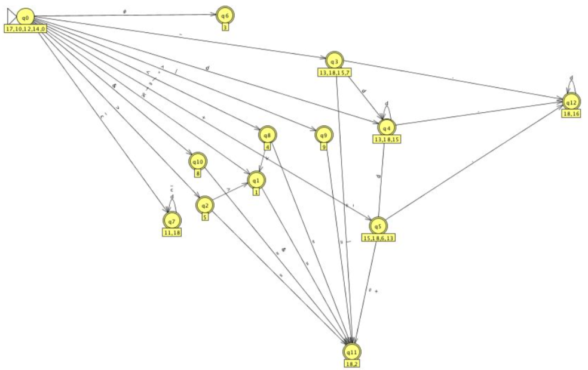
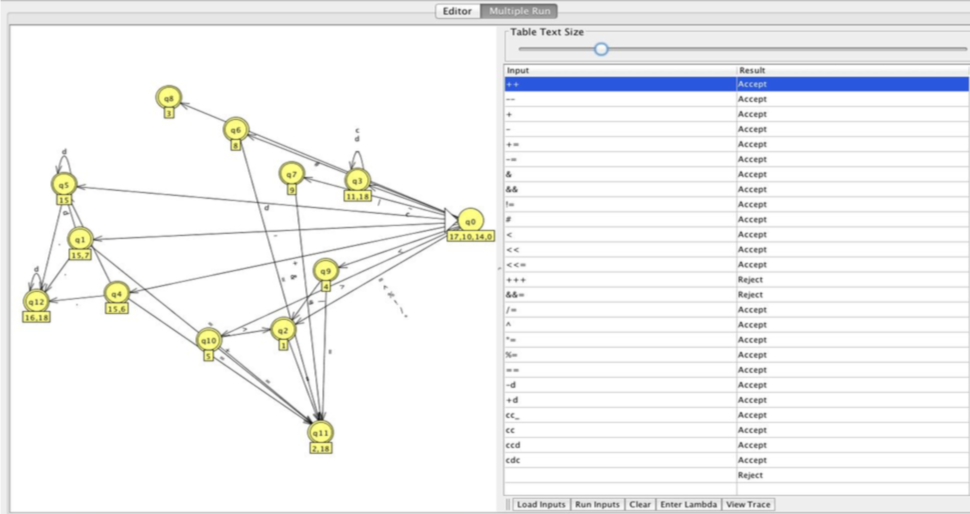

# RegularGrammar

OVERVIEW
--------------------------------------------------
The purpose of this project was to implement and test a Regular Grammar Language based on C language through Automata for the [Formal Language Theory] course. It was made at the Computer Science undergraduate program from University of São Paulo (ICMC - USP).

WHAT IS A REGULAR GRAMMAR LANGUAGE?
--------------------------------------------------
In theoretical computer science and formal language theory, a regular language is a formal language that can be expressed using a regular expression.

GRAMMAR
--------------------------------------------------
With the grammar below, it is possible to detect Identifiers, Integers (signed and unsigned), Float (signed and unsigned) and special characters.

```bash
G​ ​=​ ​({A,​ ​S,​ ​I,​ ​E,​ ​H,​ ​D,​ ​B,​ ​L,​ ​C,​ ​G,​ ​K,​ ​F,​ ​J},​ ​{A-Z,​ ​a-z,​ ​0-9,​ special,​ ​_},​ ​P,​ ​S)
special ​=​ ​special characters which are permited in the C language,​ ​Exemplo:​ ​(​ ​=,​ ​==,​ ​<,​ ​>, <=,​ ​>=,​ ​!=,​ ​&&,​ ​||,​ ​*=,​ ​+=,​ ​-=,​ ​/=,​ ​%=,​ ​etc).
```

PRODUCTION RULES
--------------------------------------------------
Through production rules it is possible to generate the grammar above.

```bash
S​ ​→​ ​+E​ ​|​ ​>B​ ​|​ ​<H​ ​|​ ​/A​ ​|​ ​*A​ ​|​ ​%A​ ​|​ ​!A​ ​|​ ​|I​ ​|​ ​=A​ ​|​ ​&J​ ​|​ ​dD​ ​|​ ​^A​ ​|​ ​-C​ ​|​ ​cG​ ​|​ ​_G​ ​|​ ​#F A​ ​→​ ​=K​ ​|​ ​ε
I​ ​→​ ​IK​ ​|​ ​ε​ ​|​ ​=K
E​ ​→​ ​.L​ ​|​ ​ε​ ​|​ ​+K​ ​|​ ​dD
H​ ​→​ ​<A​ ​|​ ​=K​ ​|​ ​ε D​ ​→​ ​.L​ ​|​ ​ε​ ​|​ ​dD B​ ​→​ ​>A​ ​|​ ​ε​ ​|​ ​=K L​ ​→​ ​ε​ ​|​ ​dL
C​ ​→​ ​dD​ ​|​ ​.L​ ​|​ ​-K​ ​|​ ​ε​ ​|​ ​=K G​ ​→​ ​ε​ ​|​ ​_G​ ​|​ ​cG​ ​|​ ​dG
K​ ​→​ ​ε
F​ ​→​ ​ε
J​ ​→​ ​ε​ ​|​ ​=K​ ​|​ ​&K


a​ ​=​ ​​ characters ​A-Z​ ​a-z
d​ ​=​ ​​ digits ​0-9
```

AUTOMATA
--------------------------------------------------


LANGUAGE TEST
--------------------------------------------------
The Grammar was tested using JFLAP application (All files can be found inside the `JFLAP files` folder).



MORE INFO
--------------------------------------------------
* Please check the file `project report.pdf` to know more about this project.
